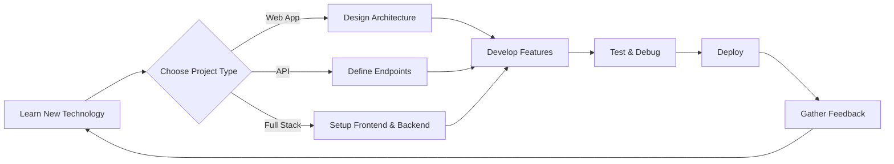

# Harshil Joshi

**Innovating Software with Python, Django, FastAPI, and Full-Stack Development**  
_Freelancer | Associate Software Develpor | Driven by a Passion for Cutting-Edge Technology_

---

Welcome! 👋 I’m **Harshil Joshi**, a software developer passionate about building robust, scalable, and innovative solutions. I specialize in backend and full-stack web development, leveraging modern frameworks and languages to solve real-world problems.

---

## 🔭 About Me

- **Full-Stack Developer** focused on Python, Django, and FastAPI.
- **Freelancer** with experience in a variety of web projects.
- **Constant Learner** interested in new technologies and best practices.

You can reach me at:  
📫 **harshil.y.joshi.2004@gmail.com**

---

## 🚀 Recent Projects

Explore some of my latest work:

| Project Name                | Description                       | Link                                                                  |
|-----------------------------|-----------------------------------|-----------------------------------------------------------------------|
| ERP                        | ERP Solution                      | [GitHub: ERP](https://github.com/HarshilJO/ERP)                       |
| Restaurant POS             | POS System                        | [GitHub: Restro_POS](https://github.com/HarshilJO/Restro_POS)         |
| To-Do App                  | To do app                         | [GitHub: TO-DO-app](https://github.com/HarshilJO/TO-DO-app)           |
| Retail Management API      | REST API for Inventory            | [GitHub: PHP-API](https://github.com/HarshilJO/PHP-API)               |
| Resto Inventory            | Inventory Management              | [GitHub: Resto_Inventory](https://github.com/HarshilJO/Resto_Inventory)|

---

## 🌐 Socials

Connect with me on your favorite platform:

[](https://www.instagram.com/harshil.__.joshi/)
[](https://www.linkedin.com/in/harshil-joshi-50726f6772616d6d6572/)
[](https://github.com/HarshilJO/)

---

## 💻 Tech Stack

Here are some of the technologies and tools I use regularly:

| **Language / Framework** | **Badge**                                                                                  |
|-------------------------|--------------------------------------------------------------------------------------------|
| Python                  |      |
| NumPy                   |    |
| Pandas                  | |
| Django                  |        |
| FastAPI                 | |
| C / C++                 |  |
| SCSS                    |         |
| HTML5                   |    |
| JavaScript              | |
| Express                 | |
| Angular               | |

---

## 📈 Top Languages Used

See my most-used languages on GitHub:

[](https://github.com/HarshilJO)

---

## 📊 GitHub Stats

|  |  |
|----------------------------------------------------------------------------------------------------------------------------------|--------------------------------------------------------------------------------|
|                                                                                                                     |                                                                                |

---

## 🌀 WorkFlow

Below is a simple animated representation of my software journey and workflow:



---

```card
{
    "title": "Open to Collaborations",
    "content": "Feel free to reach out if you'd like to work together or discuss a project idea!"
}
```

---

## ✨ Final Notes

- I’m always open to learning and sharing knowledge.
- Let’s build something amazing together!

---

Thank you for visiting my profile! 🚀
